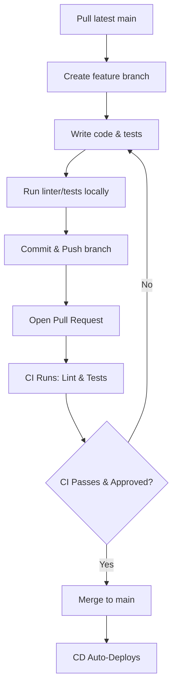

# Git Workflow and Team Development Rules

This document outlines the branching strategy, continuous integration/deployment (CI/CD) standards, and a modular work breakdown structure to help the team build the game collaboratively and efficiently.

---

## 1. Branching Strategy and Git Workflow

To maintain a clean, stable repository and prevent conflicts, the team will follow a strict **Feature Branch Workflow** (similar to GitHub Flow).

### The Golden Rule
> [!IMPORTANT]
> The `main` branch must always represent a fully working, playable version of the game that compiles, has no errors, and runs at 60 FPS. **Never commit directly to `main`.**

### Step-by-Step Developer Workflow



1. **Sync Local Repository:**
   Before starting any work, sync your local repository with the remote `main` branch:
   ```bash
   git checkout main
   git pull origin main
   ```

2. **Create a Feature Branch:**
   Create a branch for your task. Use a clear, prefix-based naming convention:
   * `feature/` for new features (e.g., `feature/player-movement`)
   * `bugfix/` for bug fixes (e.g., `bugfix/laser-collision`)
   * `docs/` for documentation updates (e.g., `docs/add-comments`)
   ```bash
   git checkout -b feature/player-movement
   ```

3. **Develop and Test Locally:**
   Write your feature code. Ensure you are conforming to the performance criteria (no reflows, using `transform`/`opacity` for animation, checking FPS in browser DevTools).

4. **Verify Locally (Linting and Tests):**
   Run the static analysis check to ensure your changes adhere to standard styling and don't introduce syntax errors:
   ```bash
   npm run lint
   ```
   If unit tests are implemented, run:
   ```bash
   npm run test
   ```

5. **Commit and Push:**
   Write clear, descriptive commit messages.
   ```bash
   git add .
   git commit -m "feat: implement player horizontal movement using CSS transform"
   git push -u origin feature/player-movement
   ```

6. **Create a Pull Request (PR):**
   * Go to Gitea and open a Pull Request from `feature/player-movement` into `main`.
   * Add a description explaining what your changes do and how you verified them.
   * Assign at least one teammate to review your code.

7. **CI/CD Check and Code Review:**
   * Gitea Actions will run ESLint and any unit tests automatically.
   * Your reviewer will read the code, check performance considerations, and approve the PR or request changes.

8. **Merge:**
   Once the CI pipeline passes and you receive approval, merge the PR. The CD pipeline will automatically deploy the updated game to the web server.

---

## 2. CI/CD & Unit Testing Policy

### Does setting up a CI/CD pipeline mean that each time a feature is made it should have the required unit tests?

> [!NOTE]
> **Technically, no, but practically, yes.**

* **The Pipeline View:** A CI/CD pipeline does exactly what we tell it to do. If we only configure it to run `npm run lint` (syntax check), it will not require unit tests to pass.
* **The Best Practice View:** In professional environments, **yes, every new feature must include its corresponding unit tests**. The pipeline is then configured to execute those tests automatically (e.g., via `npm run test`).
* **Why we should do it:** Because we are building a game that must strictly hit **60 FPS** at all times, we want tests that check:
  1. Performance rules (e.g. asserting that no function calls cause layout recalculations).
  2. Game state logic (e.g. player lives decreasing on hit, score increasing on malware defeat).
  3. Edge cases (e.g. pause menu halting game state updates).

**Recommendation:** The team should write unit tests for core game logic (e.g. scoring, colliders, status changes) and configure the CI runner to run tests. If a developer submits a PR with no tests, or if their tests fail, the PR is automatically blocked from merging.

---

## 3. Work Breakdown Structure (System Override Concept)

Here is a breakdown of the development tasks into independent, manageable steps that can be assigned to different team members.

### Phase 1: Setup & Core Systems

#### Task 1.1: Project Init & Pipeline Configuration
* **Description:** Initialize the project repository and set up dependencies and pipeline files.
* **Deliverables:**
  * `package.json` with scripts for `"lint": "eslint ./**/*.js"` and `"test"` (using Jest/Vitest).
  * Configurations for ESLint (`.eslintrc.json`).
  * Gitea workflow file (`.gitea/workflows/ci-cd.yaml`) configuring linting and testing stages.
  * Barebones project structure: `index.html`, `src/game.js`, `src/styles.css`.
* **Assignee:** Developer A

#### Task 1.2: The Game Loop & Input System
* **Description:** Create the core engine loop and a robust, stutter-free input reader.
* **Deliverables:**
  * A central `requestAnimationFrame` loop that calculates delta-time (`dt`) and monitors FPS.
  * A global Keyboard listener object (e.g., mapping `keys['ArrowLeft'] = true/false` on keydown/keyup).
  * A system to prevent key-repeat delay (ensuring movement is smooth rather than stuttering when a key is held down).
* **Assignee:** Developer B

---

### Phase 2: Game Entities

#### Task 2.1: Player Firewall (Spacecraft) Implementation
* **Description:** Build the player entity at the bottom of the screen.
* **Deliverables:**
  * Player DOM element centered horizontally at the bottom.
  * Player update function inside the game loop checking key states to adjust position.
  * Position update using `transform: translateX(...)` exclusively.
  * Boundaries containment to keep the player from moving off-screen.
* **Assignee:** Developer C

#### Task 2.2: Enemy Malware (Invader Grid) & Object Pooling
* **Description:** Implement descending malware items using rendering optimizations.
* **Deliverables:**
  * Malware grid grouped in a single parent container to allow animating the whole group using a single `transform: translate(x, y)` call.
  * Object pool for individual malware elements to toggle visibility/opacity instead of destroying and recreating DOM nodes.
  * Grid movement logic: slides left/right, drops down on hitting screen edges, and moves faster as elements are destroyed.
* **Assignee:** Developer D

---

### Phase 3: Physics & Projectiles

#### Task 3.1: Data Packet Projectiles (Bullets) & Collision System
* **Description:** Implement upward-moving projectiles and check for hits.
* **Deliverables:**
  * Projectile object pool to reuse packet elements (preventing garbage collection pauses).
  * Fire mechanism: spaceships spawn a packet when the spacebar is pressed (with cooldown/firing rate limit).
  * Packet motion inside the game loop (upward translation).
  * Collision detection using lightweight AABB (Axis-Aligned Bounding Box) logic.
* **Assignee:** Developer E

---

### Phase 4: Interface & Game Logic

#### Task 4.1: HUD & Scoring System
* **Description:** Track game metrics and display them to the user.
* **Deliverables:**
  * Score HUD tracking:
    * "Megabytes Recovered" (Points).
    * "System Integrity Level" (Lives remaining).
    * "Time until Total System Failure" (Countdown clock).
  * CSS styling conforming to the Cyberpunk theme (neon, glowing texts, monospace font).
  * Logic triggering game-over when the timer runs out or lives reach 0, and victory when all malware is cleared.
* **Assignee:** Developer A

#### Task 4.2: Game States & Pause Overlay Menu
* **Description:** Create states to control game flow, and a performance-optimized pause menu.
* **Deliverables:**
  * Game states: `START`, `PLAYING`, `PAUSED`, `GAME_OVER`, `VICTORY`.
  * Keyboard handler for pressing `Escape` to toggle the `PAUSED` state.
  * High-performance Pause overlay menu displaying "Continue" and "Restart".
  * Logic ensuring that no frames are rendered/updated and no performance drops occur when paused.
* **Assignee:** Developer B / C

---

### Phase 5: Verification & Polishing

#### Task 5.1: Performance Testing & FPS Optimization
* **Description:** Audit the application using DevTools to guarantee constant 60 FPS.
* **Deliverables:**
  * Use the Chrome/Firefox Performance tool to record gameplay.
  * Audit paint flashing to confirm only updated components are being redrawn.
  * Verify that no modifications are made to `top`, `left`, `width`, or `height` (avoiding layout thrashing).
* **Assignee:** Whole Team

---

## 4. Critical Technical Decisions & Best Practices (Before Coding)

Before the team writes the first line of code, establish these architectural agreements to avoid major refactoring later:

### A. Local HTTP Server Requirement (No `file://`)
* **Problem:** Browsers restrict ES modules (`import`/`export`), custom web fonts, and audio loading when accessing the page via the local filesystem (`file:///C:/...`).
* **Rule:** Everyone on the team must run the game using a local HTTP server.
  * **Option 1:** Use VS Code's "Live Server" extension.
  * **Option 2:** Run `npx serve` or `python -m http.server 8000` in the repository root.

### B. Fixed Aspect Ratio & Virtual Coordinates
* **Problem:** If players resize their browser window, collision detection and boundary calculations in absolute CSS pixels (`px`) will break or render differently across screens.
* **Rule:** Use a virtual resolution (e.g., **800x600** or **1024x768**):
  1. Define a container `div` (e.g., `#game-viewport`) with absolute width and height (e.g., `800px` by `600px`).
  2. Perform all game-math (coordinates, speeds, dimensions) based on this fixed coordinate system.
  3. Scale the container `div` dynamically using CSS transforms (`transform: scale(...)`) to fit the player's browser window while maintaining the aspect ratio. This keeps performance high and layout consistent.

### C. Assets Preloading
* **Problem:** Loading images (sprites) or audio files on-the-fly during gameplay causes garbage collection pauses and network latency, causing immediate frame drops (jank).
* **Rule:** Implement a Promise-based asset loader:
  * Load all images and audio resources *before* transitioning from the `START` screen to the `PLAYING` screen.
  * Disable start/continue actions until the loader has successfully cached all assets.

### D. Development-Only HUD (Real-time Stats)
* **Problem:** Opening browser DevTools can sometimes artificially slow down rendering performance, skewing FPS results.
* **Rule:** Include a toggleable development overlay in the DOM (e.g., press `F3` or `tilde`) displaying:
  * **Current FPS** (updated every 0.5s).
  * **Delta Time (dt)** in milliseconds.
  * **Active DOM Node Count** (verifying that projectile/enemy object pools are working correctly and not leaking memory).

### E. Standard `.gitignore`
* **Rule:** Add a `.gitignore` file to the root of your repository immediately. Prevent team members from pushing:
  * `node_modules/`
  * System files (like `.DS_Store` or `Thumbs.db`)
  * Editor configurations (like `.vscode/` unless shared)

